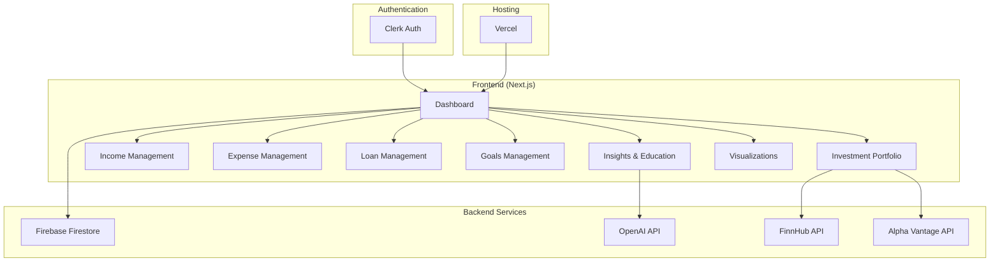
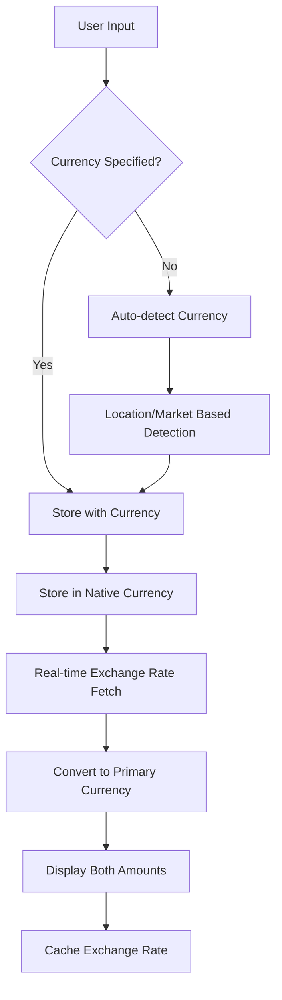

# Design Document

## Overview

Foresight is a Next.js-based personal financial education and planning application that helps everyday people understand and manage their finances. The application follows a modular, page-based architecture with a focus on user education, clear visualizations, and actionable insights. The design emphasizes simplicity and accessibility to ensure that users with varying levels of financial literacy can benefit from the platform.

## Architecture

### High-Level Architecture



### Technology Stack Integration

- **Frontend**: Next.js 14 with App Router for server-side rendering and optimal performance
- **Styling**: Tailwind CSS for responsive, utility-first styling
- **Authentication**: Clerk for secure user management and session handling
- **Database**: Firebase Firestore for real-time data storage and synchronization
- **AI Integration**: OpenAI API for generating personalized financial insights and education
- **Financial Data**: FinnHub.io for real-time market data, Alpha Vantage for historical data
- **Currency Exchange**: Exchange rates API for real-time and historical currency conversion
- **Internationalization**: Built-in currency formatting and locale support
- **Deployment**: Vercel for seamless deployment and hosting

## Components and Interfaces

### Core Components

#### 1. Authentication Layer

```typescript
interface AuthProvider {
  user: User | null;
  isLoading: boolean;
  signIn: () => Promise<void>;
  signOut: () => Promise<void>;
}

interface User {
  id: string;
  email: string;
  firstName: string;
  lastName: string;
  primaryCurrency: string;
  locale: string;
  createdAt: Date;
}
```

#### 2. Dashboard Component

```typescript
interface DashboardData {
  netWorth: CurrencyAmount;
  monthlyIncome: CurrencyAmount;
  monthlyExpenses: CurrencyAmount;
  totalDebt: CurrencyAmount;
  goalProgress: GoalSummary[];
  financialHealthScore: number;
  currencyExposure: CurrencyExposure[];
}

interface CurrencyAmount {
  amount: number;
  currency: string;
  convertedAmount?: number; // Amount in user's primary currency
  exchangeRate?: number;
  lastUpdated?: Date;
}

interface CurrencyExposure {
  currency: string;
  totalValue: CurrencyAmount;
  percentage: number;
  riskLevel: "low" | "medium" | "high";
}

interface DashboardProps {
  data: DashboardData;
  onNavigate: (section: string) => void;
}
```

#### 3. Financial Data Components

**Investment Portfolio**

```typescript
interface Investment {
  id: string;
  userId: string;
  type:
    | "stocks"
    | "etf"
    | "options"
    | "bonds"
    | "mutual_funds"
    | "real_estate"
    | "crypto"
    | "other";
  name: string;
  symbol?: string;
  quantity: number;
  purchasePrice: CurrencyAmount;
  currentPrice?: CurrencyAmount;
  purchaseDate: Date;
  description?: string;
  currency: string; // Native currency of the investment
  exchange?: string; // Stock exchange (NYSE, NASDAQ, LSE, etc.)

  // Type-specific data
  stockData?: StockData;
  optionData?: OptionData;
  bondData?: BondData;
  mutualFundData?: MutualFundData;
  etfData?: ETFData;
  realEstateData?: RealEstateData;
  cryptoData?: CryptoData;
}

// Type-specific data interfaces
interface StockData {
  dividend?: number;
  dividendYield?: number;
  sector?: string;
  marketCap?: number;
}

interface OptionData {
  strikePrice: CurrencyAmount;
  expirationDate: Date;
  optionType: "call" | "put";
  premium: CurrencyAmount;
  underlyingSymbol: string;
  impliedVolatility?: number;
  delta?: number;
  gamma?: number;
  theta?: number;
  vega?: number;
}

interface BondData {
  faceValue: CurrencyAmount;
  couponRate: number;
  maturityDate: Date;
  yieldToMaturity?: number;
  creditRating?: string;
  duration?: number;
  issuer?: string;
}

interface MutualFundData {
  expenseRatio: number;
  nav: CurrencyAmount;
  fundFamily: string;
  category?: string;
  turnoverRate?: number;
  inceptionDate?: Date;
}

interface ETFData {
  expenseRatio: number;
  nav: CurrencyAmount;
  underlyingIndex: string;
  trackingError?: number;
  dividendYield?: number;
  assetsUnderManagement?: CurrencyAmount;
}

interface RealEstateData {
  propertyType: "residential" | "commercial" | "reit" | "land";
  address?: string;
  squareFootage?: number;
  monthlyRent?: CurrencyAmount;
  propertyTax?: CurrencyAmount;
  maintenanceCosts?: CurrencyAmount;
  occupancyRate?: number;
}

interface CryptoData {
  blockchain: string;
  marketCap?: CurrencyAmount;
  circulatingSupply?: number;
  maxSupply?: number;
  stakingReward?: number;
}

interface PortfolioSummary {
  totalValue: CurrencyAmount;
  totalGainLoss: CurrencyAmount;
  gainLossPercentage: number;
  diversificationScore: number;
  riskLevel: "low" | "medium" | "high";
  currencyExposure: CurrencyExposure[];
}
```

**Income Management**

```typescript
interface Income {
  id: string;
  userId: string;
  type: "salary" | "bonus" | "other";
  source: string;
  amount: CurrencyAmount;
  frequency: "weekly" | "bi-weekly" | "monthly" | "quarterly" | "annually";
  startDate: Date;
  endDate?: Date;
  isActive: boolean;
}
```

**Expense Management**

```typescript
interface Expense {
  id: string;
  userId: string;
  category: "rent" | "groceries" | "utilities" | "entertainment" | "other";
  name: string;
  amount: CurrencyAmount;
  frequency: "daily" | "weekly" | "monthly" | "quarterly" | "annually";
  isFixed: boolean;
  startDate: Date;
  endDate?: Date;
}
```

**Loan Management**

```typescript
interface Loan {
  id: string;
  userId: string;
  type: "home" | "car" | "personal" | "other";
  name: string;
  principal: CurrencyAmount;
  currentBalance: CurrencyAmount;
  interestRate: number;
  termMonths: number;
  monthlyPayment: CurrencyAmount;
  startDate: Date;
  nextPaymentDate: Date;
}
```

**Goals Management**

```typescript
interface Goal {
  id: string;
  userId: string;
  type: "retirement" | "education" | "vacation" | "emergency_fund" | "other";
  name: string;
  targetAmount: CurrencyAmount;
  currentAmount: CurrencyAmount;
  targetDate: Date;
  monthlyContribution: CurrencyAmount;
  priority: "low" | "medium" | "high";
  isActive: boolean;
}
```

#### 4. Visualization Components

**Financial Health Visualization**

```typescript
interface FinancialHealthMetrics {
  netWorthTrend: CurrencyDataPoint[];
  debtToIncomeRatio: number;
  emergencyFundMonths: number;
  savingsRate: number;
  investmentDiversification: DiversificationData;
  overallScore: number;
  currencyRiskScore: number;
}

interface CurrencyDataPoint {
  date: Date;
  value: CurrencyAmount;
}
```

**Cash Flow Visualization**

```typescript
interface CashFlowData {
  monthlyIncome: CurrencyDataPoint[];
  monthlyExpenses: CurrencyDataPoint[];
  netCashFlow: CurrencyDataPoint[];
  projectedCashFlow: CurrencyDataPoint[];
  seasonalPatterns: SeasonalPattern[];
  currencyFlows: CurrencyFlowData[];
}

interface CurrencyFlowData {
  currency: string;
  inflow: CurrencyDataPoint[];
  outflow: CurrencyDataPoint[];
  netFlow: CurrencyDataPoint[];
}
```

#### 5. AI Insights Component

```typescript
interface InsightRequest {
  userId: string;
  financialData: UserFinancialSnapshot;
  insightType: "risk_profile" | "tax_optimization" | "general_advice";
}

interface InsightResponse {
  insights: string[];
  recommendations: Recommendation[];
  educationalContent: EducationalContent[];
  riskLevel: "low" | "medium" | "high";
}
```

### API Layer Design

#### 1. Financial Data APIs

```typescript
// Internal API Routes
/api/investments
  - GET: Fetch user investments
  - POST: Add new investment
  - PUT: Update investment
  - DELETE: Remove investment

/api/market-data/search
  - GET: Search for stocks by symbol or company name

/api/market-data/quote
  - GET: Get real-time stock price and market data

/api/income
  - GET: Fetch user income sources
  - POST: Add income source
  - PUT: Update income source
  - DELETE: Remove income source

/api/expenses
  - GET: Fetch user expenses
  - POST: Add expense
  - PUT: Update expense
  - DELETE: Remove expense

/api/loans
  - GET: Fetch user loans
  - POST: Add loan
  - PUT: Update loan
  - DELETE: Remove loan

/api/goals
  - GET: Fetch user goals
  - POST: Add goal
  - PUT: Update goal
  - DELETE: Remove goal

/api/currencies
  - GET: Get supported currencies and current exchange rates
  - POST: Update user's primary currency preference

/api/exchange-rates
  - GET: Get current exchange rates for specific currency pairs
  - GET /historical: Get historical exchange rates for date range
```

#### 2. External API Integration

```typescript
// Market Data Service
interface MarketDataService {
  getRealTimePrice(symbol: string): Promise<number>;
  getHistoricalData(symbol: string, period: string): Promise<HistoricalData[]>;
  getMarketNews(symbols: string[]): Promise<NewsItem[]>;
  searchSymbols(query: string): Promise<SearchResult[]>;
  getCompanyProfile(symbol: string): Promise<CompanyProfile | null>;
}

interface SearchResult {
  symbol: string;
  description: string;
  type: string;
}

interface CompanyProfile {
  name: string;
  industry: string;
  sector: string;
  country: string;
}

// AI Insights Service
interface AIInsightsService {
  generateInsights(userData: UserFinancialSnapshot): Promise<InsightResponse>;
  explainFinancialConcept(concept: string): Promise<string>;
  assessRiskProfile(portfolio: Investment[]): Promise<RiskAssessment>;
}

// Currency Exchange Service
interface CurrencyService {
  getSupportedCurrencies(): Promise<Currency[]>;
  getCurrentExchangeRate(from: string, to: string): Promise<ExchangeRate>;
  getHistoricalExchangeRates(from: string, to: string, startDate: Date, endDate: Date): Promise<HistoricalExchangeRate[]>;
  convertAmount(amount: number, from: string, to: string): Promise<CurrencyAmount>;
  formatCurrency(amount: number, currency: string, locale?: string): string;
  detectCurrencyFromLocation(countryCode: string): string;
}

interface Currency {
  code: string; // ISO 4217 currency code (USD, EUR, GBP, etc.)
  name: string;
  symbol: string;
  decimalPlaces: number;
  countries: string[];
}

interface ExchangeRate {
  from: string;
  to: string;
  rate: number;
  timestamp: Date;
  source: string;
}

interface HistoricalExchangeRate extends ExchangeRate {
  date: Date;
}
```

## Multi-Currency Architecture

### Currency Management Strategy

The application implements a comprehensive multi-currency system that supports:

1. **Native Currency Storage**: All financial data is stored in its original currency
2. **Real-time Conversion**: Dynamic conversion to user's primary currency for display
3. **Historical Accuracy**: Historical exchange rates for accurate period-specific analysis
4. **Currency Risk Assessment**: Analysis of foreign exchange exposure and risk

### Currency Conversion Flow



### Exchange Rate Management

1. **Real-time Rates**: Fetched from reliable financial data providers
2. **Rate Caching**: Exchange rates cached for 15 minutes to reduce API calls
3. **Fallback Strategy**: Use last known rates if real-time rates unavailable
4. **Historical Rates**: Stored for accurate historical analysis and reporting
5. **Rate Alerts**: Notify users of significant currency fluctuations affecting their portfolio

### Currency Risk Analysis

```typescript
interface CurrencyRiskAnalysis {
  totalExposure: CurrencyExposure[];
  riskScore: number; // 0-100, higher = more risk
  recommendations: string[];
  hedgingOpportunities: HedgingOption[];
  volatilityMetrics: CurrencyVolatility[];
}

interface HedgingOption {
  currency: string;
  currentExposure: number;
  recommendedHedge: number;
  hedgingInstruments: string[];
}

interface CurrencyVolatility {
  currency: string;
  volatility30d: number;
  volatility90d: number;
  volatility1y: number;
  trend: "increasing" | "decreasing" | "stable";
}
```

### Localization and Formatting

```typescript
interface CurrencyFormatter {
  formatAmount(amount: number, currency: string, locale: string): string;
  formatWithConversion(original: CurrencyAmount, targetCurrency: string, locale: string): string;
  getSymbol(currency: string): string;
  getDecimalPlaces(currency: string): number;
}

// Examples:
// USD in en-US: $1,234.56
// EUR in de-DE: 1.234,56 €
// JPY in ja-JP: ¥1,235 (no decimals)
// INR in en-IN: ₹1,23,456.78 (Indian number system)
```

## Data Models

### Firebase Firestore Collections

#### Users Collection

```typescript
interface UserDocument {
  id: string; // Clerk user ID
  email: string;
  firstName: string;
  lastName: string;
  preferences: {
    primaryCurrency: string; // ISO 4217 currency code
    locale: string; // BCP 47 language tag (en-US, de-DE, etc.)
    riskTolerance: "conservative" | "moderate" | "aggressive";
    notifications: boolean;
    showOriginalCurrencies: boolean; // Whether to show original currencies alongside converted amounts
    autoDetectCurrency: boolean; // Auto-detect currency based on location/market
  };
  createdAt: Timestamp;
  updatedAt: Timestamp;
}
```

#### Financial Data Collections

```typescript
// Collection: users/{userId}/investments
interface InvestmentDocument extends Investment {
  createdAt: Timestamp;
  updatedAt: Timestamp;
}

// Collection: users/{userId}/income
interface IncomeDocument extends Income {
  createdAt: Timestamp;
  updatedAt: Timestamp;
}

// Collection: users/{userId}/expenses
interface ExpenseDocument extends Expense {
  createdAt: Timestamp;
  updatedAt: Timestamp;
}

// Collection: users/{userId}/loans
interface LoanDocument extends Loan {
  createdAt: Timestamp;
  updatedAt: Timestamp;
}

// Collection: users/{userId}/goals
interface GoalDocument extends Goal {
  createdAt: Timestamp;
  updatedAt: Timestamp;
}
```

#### Calculated Data Collection

```typescript
// Collection: users/{userId}/snapshots
interface FinancialSnapshotDocument {
  id: string;
  userId: string;
  date: Timestamp;
  netWorth: CurrencyAmount;
  totalIncome: CurrencyAmount;
  totalExpenses: CurrencyAmount;
  totalDebt: CurrencyAmount;
  savingsRate: number;
  financialHealthScore: number;
  currencyExposure: CurrencyExposure[];
  exchangeRatesUsed: ExchangeRateSnapshot[];
  createdAt: Timestamp;
}

// Collection: exchange_rates (global collection for caching)
interface ExchangeRateDocument {
  id: string; // Format: "USD_EUR_2024-01-15"
  from: string;
  to: string;
  rate: number;
  date: Timestamp;
  source: string;
  createdAt: Timestamp;
}

interface ExchangeRateSnapshot {
  from: string;
  to: string;
  rate: number;
  timestamp: Timestamp;
}
```

## Error Handling

### Error Types and Handling Strategy

#### 1. Authentication Errors

```typescript
interface AuthError {
  type: "AUTH_ERROR";
  code: "UNAUTHORIZED" | "SESSION_EXPIRED" | "INVALID_TOKEN";
  message: string;
  redirectTo?: string;
}
```

#### 2. API Errors

```typescript
interface APIError {
  type: "API_ERROR";
  code: "NETWORK_ERROR" | "SERVER_ERROR" | "RATE_LIMITED" | "INVALID_REQUEST";
  message: string;
  retryable: boolean;
}
```

#### 3. Data Validation Errors

```typescript
interface ValidationError {
  type: "VALIDATION_ERROR";
  field: string;
  message: string;
  value: any;
}
```

#### 4. Currency Errors

```typescript
interface CurrencyError {
  type: "CURRENCY_ERROR";
  code: "UNSUPPORTED_CURRENCY" | "EXCHANGE_RATE_UNAVAILABLE" | "CONVERSION_FAILED" | "STALE_RATES";
  message: string;
  currency?: string;
  fallbackUsed?: boolean;
}
```

### Error Handling Implementation

1. **Global Error Boundary**: React Error Boundary to catch and display user-friendly error messages
2. **API Error Interceptor**: Centralized error handling for all API calls with retry logic
3. **Form Validation**: Real-time validation with clear error messages
4. **Fallback UI**: Graceful degradation when external services are unavailable
5. **Currency Fallbacks**: Use cached/historical rates when real-time rates unavailable
6. **Rate Staleness Warnings**: Alert users when exchange rates are outdated
7. **Error Logging**: Comprehensive error logging for debugging and monitoring

## Testing Strategy

### Testing Approach

#### 1. Unit Testing

- **Components**: Test individual React components with React Testing Library
- **Utilities**: Test calculation functions, data transformations, and business logic
- **API Routes**: Test Next.js API routes with mock data
- **Coverage Target**: 80% code coverage for critical business logic

#### 2. Integration Testing

- **Database Operations**: Test Firebase Firestore operations with emulator
- **External API Integration**: Test with mock responses and error scenarios
- **Authentication Flow**: Test Clerk integration with test users
- **End-to-End User Flows**: Test complete user journeys

#### 3. Performance Testing

- **Page Load Times**: Ensure pages load within 2 seconds
- **API Response Times**: Monitor and optimize API response times
- **Bundle Size**: Keep JavaScript bundle size optimized
- **Accessibility**: Test with screen readers and keyboard navigation

#### 4. Security Testing

- **Authentication**: Verify proper session management and token validation
- **Data Access**: Ensure users can only access their own data
- **Input Validation**: Test for SQL injection, XSS, and other vulnerabilities
- **API Security**: Verify proper rate limiting and input sanitization

### Testing Tools and Framework

```typescript
// Testing Stack
- Jest: Unit testing framework
- React Testing Library: Component testing
- Cypress: End-to-end testing
- Firebase Emulator: Database testing
- MSW (Mock Service Worker): API mocking
- Lighthouse CI: Performance testing
```

### Test Data Management

```typescript
// Test Data Factory
interface TestDataFactory {
  createUser(currency?: string): User;
  createInvestment(overrides?: Partial<Investment>): Investment;
  createIncome(overrides?: Partial<Income>): Income;
  createExpense(overrides?: Partial<Expense>): Expense;
  createLoan(overrides?: Partial<Loan>): Loan;
  createGoal(overrides?: Partial<Goal>): Goal;
  createCurrencyAmount(amount: number, currency: string): CurrencyAmount;
  createExchangeRate(from: string, to: string, rate: number): ExchangeRate;
  createMultiCurrencyPortfolio(): Investment[];
}
```

## Security Considerations

### Data Protection

1. **Encryption**: All sensitive financial data encrypted at rest and in transit
2. **Access Control**: Firebase security rules to ensure data isolation
3. **Input Validation**: Comprehensive validation on both client and server
4. **Rate Limiting**: API rate limiting to prevent abuse

### Privacy

1. **Data Minimization**: Only collect necessary financial data
2. **User Consent**: Clear consent for data collection and AI analysis
3. **Data Retention**: Automatic data cleanup policies
4. **Third-Party Integration**: Secure handling of external API keys

### Compliance

1. **Financial Data Standards**: Follow industry best practices for financial data handling
2. **GDPR Compliance**: User data rights and deletion capabilities
3. **Audit Trail**: Comprehensive logging for security auditing

This design provides a solid foundation for building a user-friendly, secure, and globally accessible personal finance application that empowers people worldwide to understand and improve their financial situation through education, clear visualizations, and comprehensive multi-currency support. The multi-currency architecture ensures accurate financial tracking for international users while providing insights into currency risk and exposure.
